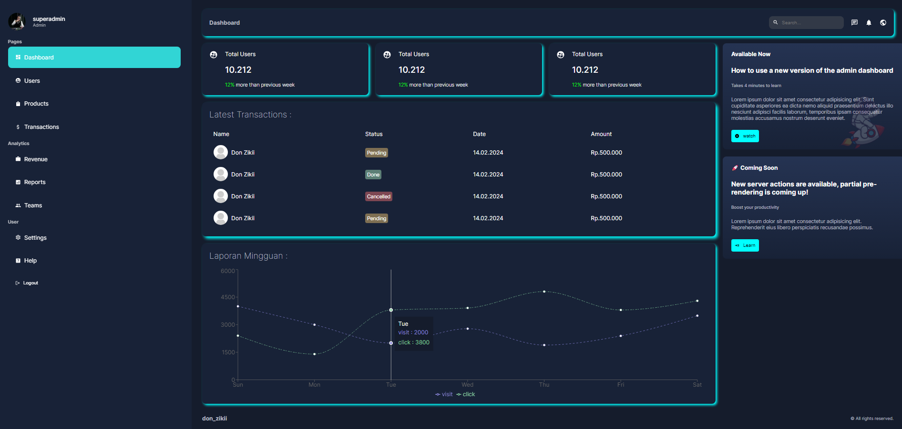
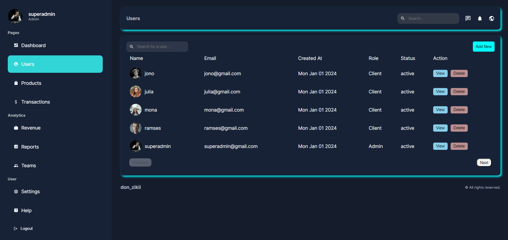
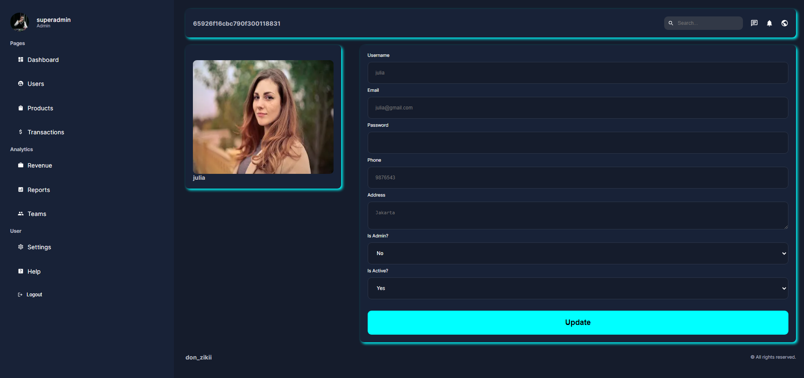

# REDME: Project Admin Dashboard

This simple admin dashboard, i build for my learning in Next.js project purpose.

---

 

## POV :

dashboard admin :
 

---

User List Menu :
 

---

User View & Update page:
 

## 

 

## Tech :

<h4>CSS, Javascript, Node.js, Nextjs, MongoDb </h4>
  

also :

- login authenticated with nextauth.
- enscript password with bcrypt
- connection to mongDB with mongoose

---

### dont forget to:

> npm install

### thank you.
